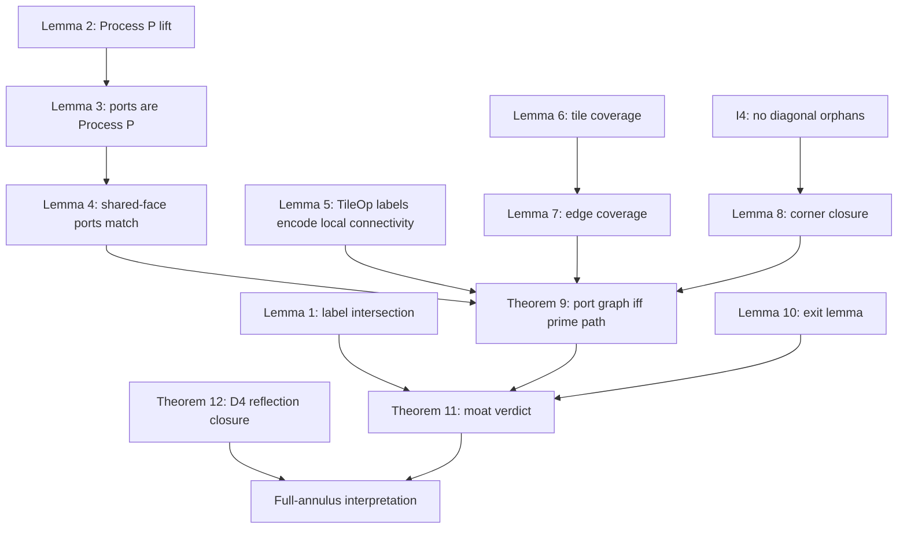

# Poster 2 Source: Tile Operator Mathematical Spine

Source canon: `methodology/tile-operator-definition-v-claude.md`

Backlog consulted only for open-status clarification: `methodology/BACKLOG.md` items B1, B2, B6, B11-B13, B16, B18-B19.

Purpose: supply poster-generation material for the step-by-step mathematical logic of the Tile Operator. This is not a replacement proof and does not introduce new math. It reorganizes the canon into visual blocks, equations, copy fragments, proof dependencies, assumptions, and failure modes.

Status labels used below:

- Canon: stated directly in the methodology or repo instructions.
- Inference: poster organization or explanatory wording derived from canon.
- Open/backlog: tracked hardening item, proof note, or implementation/doc hygiene item.

---

## One-Screen Thesis

Canon:

The Gaussian-prime graph in a huge annulus is too large for one global union-find. TileOp replaces global UF with:

1. independent local UF inside snapped-grid tile halos,
2. boundary compression into canonical face ports,
3. a stitched global port graph,
4. `inner_flag` / `outer_flag` labels on local UF components,
5. a final disjointness test.

Poster copy fragment:

> A Gaussian moat exists exactly when no connected component of the stitched port graph carries both an inner-boundary flag and an outer-boundary flag.

Primary theorem target:

```text
geo_I !~ geo_O over G_full
    iff
no component of G_ports_grid contains both I_ports and O_ports.
```

That equivalence is Theorem 11. Theorem 12 folds the octant verdict back to the full annulus by D4 symmetry.

---

## Step-By-Step Spine

### 1. Start With The Prime Graph

Canon:

```text
G_full = (V, E)
V = Gaussian primes in the bounded region.
E = { {p, q} : p, q in V and ||p - q||^2 <= K }.
```

Problem frame:

- We are probing connectivity transfer across an annular ring.
- `I` is the inner-side boundary prime set.
- `O` is the outer-side boundary prime set.
- `I ~ O` means at least one `u in I` connects to at least one `v in O` in `G_full`.
- `I !~ O` means all inner-side primes are disconnected from all outer-side primes.

Visual block:

```text
inner arc       annular region R       outer arc
  geo_I band -> prime graph paths -> geo_O band

Question: does any K-neighborhood path cross from geo_I to geo_O?
```

Poster copy fragment:

> The moat question is not "are there primes near both boundaries?" It is "does a chain of Gaussian primes, each step no longer than sqrt(K), connect the two boundary bands?"

---

### 2. Reduce Connectivity To Component-Label Intersection

Canon:

`ufs_global(v)` is the connected-component label of vertex `v` in `G_full`.

```text
u ~ v over G_full  iff  ufs_global(u) = ufs_global(v)
I ~ O              iff  ufs_global(I) intersects ufs_global(O)
I !~ O             iff  ufs_global(I) cap ufs_global(O) = empty
```

Process P abstraction:

- A set like `I` may be decomposed into local connectivity groups `P(I)`.
- Each local group must be non-empty, cover exactly vertices from `I`, lose no vertices of `I`, and be one connected local component of some `G_local subset G_full`.
- Edges may be dropped; vertices may appear in multiple local groups.

Lemma ladder:

- Lemma 1: global set connectivity equals global component-label intersection.
- Lemma 2: replacing `I` and `O` by valid Process P decompositions preserves those global labels.

Design implication:

> If ports are valid Process P groups, we can reason about global connectivity using compressed boundary objects instead of all primes.

Diagram block:

```text
I primes      -> P(I) groups      -> ufs_global(P(I))
O primes      -> P(O) groups      -> ufs_global(P(O))

intersection? yes -> connected
intersection? no  -> disconnected
```

---

### 3. Define The Annular Octant And Boundary Bands

Canon:

The octant-annulus is:

```text
R = { (x, y) in Z^2 :
      x >= 0,
      y >= x,
      R_inner^2 <= x^2 + y^2 <= R_outer^2 }
```

From the tower-tiling section onward:

```text
V(G_full) = Gaussian primes in R
E(G_full) = edges with both endpoints in R and ||p - q||^2 <= K
```

Canonical norm-form boundary sets:

```text
geo_I = { p in V(G_full) : ||p||^2 <= (R_inner + sqrt(K))^2 }
geo_O = { p in V(G_full) : ||p||^2 >= (R_outer - sqrt(K))^2 }
```

Integer arithmetic tests:

```text
p in geo_I iff (||p||^2 - R_inner^2 - K)^2 <= 4 * R_inner^2 * K
p in geo_O iff (R_outer^2 - ||p||^2 + K)^2 <= 4 * R_outer^2 * K
```

Canon nuance:

- The earlier lattice-witness form uses a lattice point `q`, not necessarily a Gaussian prime.
- The norm form and witness form are not equal in general.
- They reconcile per deployment if the "bad zones" `BZ_I` and `BZ_O` contain no Gaussian-prime norm.

Open/backlog:

- B6: BZ reconciliation is per-deployment. Future deployments must rerun the check.
- B19: prefilters for non-square `K` must use `ceil(sqrt(K))`, not `floor(sqrt(K))`, to preserve completeness.

Visual block:

```text
      outer boundary
   ====================  geo_O: ||p|| >= R_outer - sqrt(K)
   |                  |
   |  searchable R    |
   |                  |
   ====================  geo_I: ||p|| <= R_inner + sqrt(K)
      inner boundary
```

Poster copy fragment:

> Boundary membership is geometric, but evaluated arithmetically: a prime is flagged if its sqrt(K)-disk can touch outside the annulus.

---

### 4. Snap A Closed Tile Grid Onto The Region

Canon:

Tile parameters:

```text
Side   S
Collar C = floor(sqrt(K))
Halo   proper tile plus collar on all four sides
```

Tile `T_{i,j}`:

```text
origin = (o_x + iS, o_y + jS)
proper = [o_x + iS, o_x + (i+1)S] x [o_y + jS, o_y + (j+1)S]
halo   = [o_x + iS - C, o_x + (i+1)S + C]
       x [o_y + jS - C, o_y + (j+1)S + C]
```

Important closed-boundary convention:

- Proper regions are closed intervals.
- Face-adjacent tiles share a full row or column of `S + 1` lattice points.
- A boundary prime can belong to every adjacent tile whose closed proper contains it.
- This is intentional and downstream lemmas do not depend on unique ownership.

Collar sufficiency:

```text
||p - q||^2 <= K  =>  per-axis |Delta| <= floor(sqrt(K)) = C
```

Therefore, if `p` is in a tile proper, every graph neighbor `q` is in that tile halo.

Visual block:

```text
       halo(T)
   +-----------------+
   |   collar C      |
   |  +-----------+  |
   |  | proper T  |  |   closed proper has (S+1)^2 lattice points
   |  +-----------+  |
   |                 |
   +-----------------+
```

Assumptions:

- I0: `C < S/2`, so distant halos do not overlap.
- Snapped grid: all origins share the same offset `(o_x, o_y)`.

Open/backlog:

- B1: active-tile definition at the axis boundary has a harmless closed-boundary edge case for canonical `o_x = 0`; poster should avoid claiming a unique `i_min = 0` unless the convention is tightened.

---

### 5. Active Tiles Form Towers

Canon:

An active tile is one whose proper region contains at least one lattice point of `R`.

For column `i`:

```text
Tower_i = { j : T_{i,j} is active }
j_low(i)  = min Tower_i
j_high(i) = max Tower_i
```

The tile set is a staircase-shaped subset of the snapped `Z^2` index grid.

Geometric invariants:

- Cross-section Lemma: each vertical slice of `R` is empty or one closed interval.
- I1: tower contiguity, no gaps inside a tower.
- I2: adjacent tower endpoints shift by at most one tile.
- I3: adjacent towers overlap in the bulk regime.
- I4: no diagonal orphans. Every diagonally-adjacent active pair has at least one active common face-neighbor.

Open/backlog:

- B12: the tower-closing margin corollary has a tracked discrete-to-continuous proof-hardening note. The methodology later states I4 is structurally proven and no runtime gate is required, but the poster should still surface the margin-corollary proof note if presenting the proof dependency.
- B13: Theorem 11 uses the valid but looser tile-diameter bound `S * sqrt(2)`; a tighter interior bound could strengthen the margin.

Diagram block:

```text
Index-grid view:

        outer staircase
      [][][][][][]
        [][][][]       towers = vertical stacks
          [][]         exposed faces = staircase boundary
            []
        inner staircase
```

Poster copy fragment:

> The curved annulus becomes a snapped staircase of closed tiles. The proof obligation is to show this staircase preserves every prime edge that matters.

---

### 6. Give Each Tile Four Faces

Canon face naming:

```text
face_I = bottom, row = 0
face_O = top,    row = S
face_L = left,   col = 0
face_R = right,  col = S
```

Tile-relative coordinates:

```text
col = x - t_x
row = y - t_y
```

Face-prime definition:

```text
face_f_primes =
  { p in V(G_full) cap halo(T) :
    p is within perpendicular distance C of face f's boundary line }
```

Nuance:

- Face primes have no along-face restriction beyond the halo.
- A corner-halo prime may be a face prime of two faces at once.

Visual block:

```text
                face_O strip
            +----------------+
 face_L     |                |    face_R
 strip      |   tile proper  |    strip
            |                |
            +----------------+
                face_I strip

Each strip has perpendicular thickness C into/out of the face.
```

---

### 7. Build Ports From Face-Strip Connectivity

Canon:

For each face `f`, construct:

```text
G_facestrip_f:
  V = face_f_primes
  E = edges of G_full with both endpoints in face_f_primes
```

Ports are the connected components of `G_facestrip_f`.

Canonical enumeration:

```text
face_I, face_O: h = col, p_perp = row
face_L, face_R: h = row, p_perp = col

representative = member with minimum (h, p_perp)
ports sorted by representative, ordinals 1..N_f
```

Lemma 3:

Each face's `Ports(face_f_primes)` is a valid Process P decomposition of that face-prime set.

Lemma 4:

If two snapped-grid tiles share a full face, then their ports on that face are identical as ordered sets.

```text
Ports(Tile_A_face_R_primes) = Ports(Tile_B_face_L_primes)
```

Why Lemma 4 holds:

- same physical strip,
- same induced face-strip graph,
- same lexicographic order up to constant coordinate translation,
- therefore same port ordinals.

Open/backlog:

- B2: the Lemma 3 corollary may be broader than needed because it phrases a single-tile face-connectivity claim over `G_full`.
- B9 from backlog context: implementation must preserve bit-stable deterministic port enumeration.
- B16: stitching should explicitly assert the Lemma 4 shared-grid prerequisite, even if grid construction guarantees it.

Poster copy fragment:

> A port is not a pixel on the boundary. It is a whole connected component of the face strip, with a canonical ordinal shared by both tiles on the same snapped face.

---

### 8. TileOp Compresses Local UF Into Face Labels

Canon:

For tile `T`, define:

```text
G_tile:
  V = V(G_full) cap halo(T)
  E = edges of G_full with both endpoints in V(G_tile)
```

TileOp creation:

1. Run local UF over `G_tile`.
2. Build ports independently for each face using `G_facestrip_f`.
3. For each port `p`, choose any `w in port_p` and record:

```text
face_f_groups[p] := ufs_local(w; G_tile)
```

This is well-defined because each port is a connected component of `G_facestrip_f`, and `G_facestrip_f subset G_tile`.

TileOp object:

```text
TileOp_T = {
  face_I_groups,
  face_O_groups,
  face_L_groups,
  face_R_groups
}
```

Extended TileOp:

```text
TileOp_T = {
  face_I_groups,
  face_O_groups,
  face_L_groups,
  face_R_groups,
  inner_flags,
  outer_flags
}
```

Lemma 5:

For face primes `u` and `v` of the same tile:

```text
u ~ v over G_tile
    iff
ufs_local(port_u; G_tile) = ufs_local(port_v; G_tile)
```

Visual block:

```text
local UF inside halo
        |
        v
ports on four faces get local component labels

face_I_groups: [7, 7, 12]
face_O_groups: [3, 12]
face_L_groups: [7]
face_R_groups: [3, 3]
```

Poster copy fragment:

> TileOp remembers exactly what the outside world needs: which boundary ports are connected through this tile's halo.

Open/backlog:

- B18: group-count and byte-budget caps are engineering artifacts, not mathematical constraints. Overflow handling must preserve the mathematical TileOp semantics.

---

### 9. Convert TileOps Into Port Graphs

Canon:

Single-tile port graph:

```text
V(G_ports_T) = ports of Tile T, written (f, p)
E(G_ports_T) = {
  { (f, p), (f', p') } :
  (f, p) != (f', p') and
  face_f_groups[p] = face_f'_groups[p']
}
```

Interpretation:

- Same group label means the two ports connect inside `G_tile`.
- Connected components of `G_ports_T` correspond exactly to distinct local UF group labels present on ports.
- If a corner prime belongs to multiple faces, Lemma 5's corollary puts all ports containing that prime in one `G_ports_T` component.

Visual block:

```text
TileOp labels           G_ports_T

I1: group 7       I1 ----- L1
L1: group 7
O1: group 12      O1
R1: group 3       R1 ----- R2
R2: group 3
```

Poster copy fragment:

> Equal local UF labels become edges in a graph of ports. The tile has been reduced from thousands of primes to a few boundary components.

---

### 10. Stitch Neighboring Tiles By Shared-Face Ports

Canon:

For face-adjacent snapped-grid tiles A and B:

```text
E_bridge = { { (A, R, i), (B, L, i) } : i in 1..N }
```

or symmetrically for `O/I` shared faces.

Reason:

- Lemma 4 says port ordinal `i` on A's shared face and port ordinal `i` on B's shared face are the same ordered port object over the same physical face strip.
- A bridge edge identifies that same boundary connectivity group across tile-local namespaces.

Stitched graph for two tiles:

```text
G_ports_AB =
  G_ports_A
  union G_ports_B
  union bridge edges across the shared face
```

Whole-grid graph:

```text
V(G_ports_grid) = disjoint union over active T of V(G_ports_T)

E(G_ports_grid) =
  all lifted within-tile port edges
  union
  all bridge edges between active face-adjacent tiles
```

Visual block:

```text
Tile A                       Tile B
  R port 1  =================  L port 1
  R port 2  =================  L port 2
  R port 3  =================  L port 3

Bridge only face-adjacent tiles.
Diagonal adjacency is handled by I4/Lemma 8, not direct bridges.
```

Poster copy fragment:

> Stitching is not approximation. It is equality of the ordered port sets on a shared snapped face.

---

### 11. Show The Port Graph Is Equivalent To Prime Connectivity

Canon theorem:

Theorem 9, N-tile port/prime equivalence:

```text
For port primes u, v:

u ~ v over G_full
    iff
port_u and port_v lie in the same component of G_ports_grid.
```

Proof obligations in poster form:

Forward direction, port graph -> prime path:

- within-tile edge -> Lemma 5 gives a `G_tile` path, hence a `G_full` path,
- bridge edge -> Lemma 4 says both endpoints are the same face-strip port, so a shared representative witnesses identity,
- concatenate representative prime paths.

Reverse direction, prime path -> port graph walk:

- Lemma 7: every `G_full` edge lives in at least one active tile halo.
- Assign each path edge a home tile.
- Split path into maximal runs with the same home tile.
- Inside a run, Lemma 5 gives a within-tile port walk.
- At run boundaries:
  - same tile: merge,
  - face-adjacent tiles: use Lemma 4 bridge,
  - diagonal tiles: use Lemma 8 to route through an active common face-neighbor.
- Entry/exit hops use the same case split when the chosen endpoint port tile differs from the first/last edge's home tile.

Open/backlog:

- B11: the entry/exit hop relies on a small geometric sublemma about a port prime in `halo(T_u) cap halo(T_0)` being a face prime of the relevant shared/adjacent face. It follows from I0 and face-strip definitions, but should be named in a polished proof.
- B14: reflection-axis duplicate vertices in Theorem 12 are harmless if paths are interpreted as walks or duplicates are removed.

Diagram block:

```text
prime path:
u -- x1 -- x2 -- x3 -- v
 |     tile-home runs      |
 v
port graph walk:
port_u == within-tile == bridge == through-corner-neighbor == port_v
```

Poster copy fragment:

> Every true prime path can be shadowed by a walk in the stitched port graph; every port-graph walk expands back into a true prime path.

---

### 12. Attach Boundary Meaning With UF Group Flags

Canon:

For each active tile `T`, augment local UF groups with:

```text
inner_flag_T(g) =
  exists w in V(G_tile) with ufs_local(w; G_tile) = g and w in geo_I

outer_flag_T(g) =
  exists w in V(G_tile) with ufs_local(w; G_tile) = g and w in geo_O
```

Boundary port sets:

```text
I_ports = { (T, f, p) :
            inner_flag_T(face_f_groups[p]) = true }

O_ports = { (T, f, p) :
            outer_flag_T(face_f_groups[p]) = true }
```

Key conceptual fix:

- A port is in `I_ports` because its local UF component contains a `geo_I` prime.
- It does not matter whether the face itself is inner-exposed.
- Interior boundary-band primes are represented through whatever ports their local UF component reaches.
- If a component is fully isolated inside one tile and has no face prime, it cannot connect to the far boundary and is legitimately invisible to the port verdict.

Lemma 10, Exit lemma:

If a `G_full` component containing `u in V(G_T)` reaches outside `V(G_T)`, then it contains a face prime of `T` in the same `G_tile` UF group as `u`.

Visual block:

```text
geo_I prime inside tile
        |
        | local UF group g
        v
port with face_f_groups[p] = g
        |
        v
port becomes an I_ports vertex
```

Poster copy fragment:

> Boundary flags live on UF groups, not exposed faces. This is what prevents the staircase approximation from losing interior boundary-band primes.

---

### 13. Prove The Moat Verdict

Canon theorem:

Theorem 11:

```text
geo_I !~ geo_O over G_full
    iff
no component of G_ports_grid contains both an I_ports vertex and an O_ports vertex.
```

Soundness direction:

If the port graph has a mixed component:

1. Choose `(T_I, f_I, p_I) in I_ports`.
2. Its group label has some `u in geo_I`.
3. Choose a face prime `w_I` in that port; `u ~ w_I` inside `G_T_I`.
4. Symmetrically choose `u' in geo_O` and face prime `w_O`.
5. Theorem 9 gives `w_I ~ w_O` over `G_full`.
6. Chain: `u ~ w_I ~ w_O ~ u'`.
7. Therefore `geo_I ~ geo_O`; no moat.

Completeness direction:

If a global component contains both `u in geo_I` and `u' in geo_O`:

1. Lemma 6 chooses active host tiles for `u` and `u'`.
2. Their local UF groups get `inner_flag` and `outer_flag`.
3. If both groups appear on ports, Theorem 9 puts those ports in the same `G_ports_grid` component.
4. If either group has no face prime, Lemma 10 contrapositive says the whole component is trapped in one tile halo.
5. A trapped component with no face primes lies in the tile proper interior, so `||u - u'|| <= S * sqrt(2)`.
6. But `u in geo_I` and `u' in geo_O` imply:

```text
||u'|| - ||u|| >= R_outer - R_inner - 2 * sqrt(K)
```

7. Annulus thickness assumption:

```text
R_outer - R_inner > S * sqrt(2) + 2 * sqrt(K)
```

8. Contradiction. Therefore viable connectivity must surface through ports, and a mixed port component exists.

Poster copy fragment:

> The only way an inner prime can connect to an outer prime is either through a boundary port or inside a single tile. The annulus is too thick for the second case, so every real crossing appears in the port graph.

Callout:

> Theorem 11 is exact: no false moat and no missed moat, assuming the stated geometric and arithmetic obligations hold.

---

### 14. Close The Octant To The Full Annulus

Canon:

Full annulus:

```text
A = { (x, y) in Z^2 :
      R_inner^2 <= x^2 + y^2 <= R_outer^2 }
```

The octant `R` is one of eight D4-symmetric copies covering `A`.

D4 preserves:

- norm,
- Gaussian-prime status,
- squared distances,
- edges,
- `I_A` and `O_A` membership.

Theorem 12:

```text
I_R !~ O_R over G_full|_R
    iff
I_A !~ O_A over G_full|_A
```

under:

```text
R_inner > sqrt(2K)
```

Mechanism:

- Any edge from `R` can reach only `R` or one of the two adjacent octants.
- Reflecting an adjacent-octant endpoint back into `R` does not increase distance.
- Therefore any full-annulus path can be folded into an octant path.

Boundary consequence:

- Side-exposed faces at `x = 0` and `y = x` are excluded from the tile-based moat verdict.
- This is legitimate because paths exiting through adjacent octants fold back into `R`.

Open/backlog:

- B4: theorem text should eventually choose a deterministic tie-break rule on reflection axes.
- B15: theorem text should state the polar-angle convention and origin exclusion explicitly.

Poster copy fragment:

> We compute one octant because symmetry lets every full-annulus path fold back without lengthening any step.

---

## Exposed Faces And Boundary Classification

Canon:

An exposed face is an active tile face whose face-neighbor tile is not active.

Outward normals:

```text
face_I: n = ( 0, -1)
face_O: n = ( 0, +1)
face_L: n = (-1,  0)
face_R: n = (+1,  0)
```

Gradient sign:

```text
s(f) = sign( n_f . grad(x^2 + y^2) at face midpoint )
     = sign( 2 * n_f . m_f )
```

Classification:

- side-exposed: `face_L` at `i_min` or `face_R` at `i_max`, handled by Theorem 12.
- outer-exposed: not side-exposed and `s(f) > 0`.
- inner-exposed: not side-exposed and `s(f) < 0`.

Important warning:

Do not use exposed-face class as the definition of `I_ports` or `O_ports`. The canon uses `inner_flag` and `outer_flag` on local UF groups. Exposed faces explain geometry; flags drive verdict semantics.

Diagram block:

```text
exposed face classification:

outside increases radius  -> outer-exposed
outside decreases radius  -> inner-exposed
outside crosses octant    -> side-exposed, closed by D4 reflection
```

---

## Lemma Dependency Map

Poster dependency table:

| Node | Canon role | Used by |
|---|---|---|
| Lemma 1 | `I ~ O` iff global labels intersect | Theorem 11 framing |
| Lemma 2 | Process P decompositions preserve global labels | Port-level abstraction |
| Lemma 3 | Face ports are valid Process P decompositions | Port semantics |
| Lemma 4 | Shared snapped face has identical ordered ports | Bridge edges, Theorem 9 |
| Lemma 5 | Equal TileOp group labels equal `G_tile` connectivity between ports | `G_ports_T`, Theorem 9 |
| Lemma 6 | Every `G_full` prime lies in some active tile proper | Lemma 7, Theorem 11 |
| Lemma 7 | Every `G_full` edge lies in some active tile halo | Theorem 9 reverse direction |
| Lemma 8 | Diagonal active pairs have active common face-neighbor | Theorem 9 diagonal transitions |
| Theorem 9 | Port-prime connectivity equivalence | Theorem 11 |
| Lemma 10 | Exiting a tile forces a same-group face prime | Theorem 11 completeness |
| Theorem 11 | Port graph verdict equals octant moat verdict | Main pipeline correctness |
| Theorem 12 | Octant verdict equals full-annulus verdict | Full-annulus interpretation |

Mermaid diagram for poster source:



---

## Poster Layout Candidate

### Panel A: "The impossible global UF"

Visual:

- annulus with sparse prime dots,
- inner and outer boundary bands,
- a highlighted possible path.

Copy:

> Global graph too large. Verdict needed: does any sqrt(K)-step prime path cross the annulus?

Equations:

```text
E = { {p, q} : ||p - q||^2 <= K }
geo_I !~ geo_O means moat exists.
```

### Panel B: "Snap the annulus into closed tiles"

Visual:

- one octant annulus overlaid with staircase tiles,
- enlarged tile with proper and halo.

Copy:

> Closed tile boundaries intentionally overlap. The collar guarantees every neighbor of a proper-region prime survives in that tile's halo.

Equation:

```text
C = floor(sqrt(K))
```

### Panel C: "Compress each tile into ports"

Visual:

- face strips on four sides,
- face-strip components colored,
- TileOp arrays beside the tile.

Copy:

> Ports are connected components of face strips. TileOp stores the local UF group label for each ordered port.

Definition:

```text
face_f_groups[p] = ufs_local(w; G_tile), w in port_p
```

### Panel D: "Stitch by exact shared faces"

Visual:

- two adjacent tiles,
- bridge edges connecting same ordinals.

Copy:

> Snapped-grid alignment makes the shared-face port lists identical, so ordinal-to-ordinal stitching is exact.

Definition:

```text
E_bridge = { { (A,R,i), (B,L,i) } : i = 1..N }
```

### Panel E: "Flags give boundary meaning"

Visual:

- a geo_I prime deep in a tile connected to a port by local UF color,
- port marked `I`.

Copy:

> Boundary flags attach to local UF groups, not to exposed faces. This preserves interior boundary-band primes.

Definition:

```text
inner_flag_T(g) = exists w in geo_I with ufs_local(w; G_tile) = g
```

### Panel F: "Final verdict"

Visual:

- global port graph components,
- one component with only inner labels,
- one with only outer labels,
- optional red component containing both.

Copy:

> Disjoint labels mean moat. A mixed component expands to a true prime path.

Verdict:

```text
mixed I_ports/O_ports component -> SPANNING / no moat
no mixed component              -> MOAT
```

### Panel G: "Known-answer gate"

Visual:

- small table with the Tsuchimura gate.

Copy:

> The known-answer gate validates the implementation route, not the proof.

Gate from repo instructions:

| K | R_inner | R_outer | Expected verdict | Semantics |
|---|---:|---:|---|---|
| 36 | 80,000,000 | 80,015,782 | `SPANNING` | full annulus anchored at `R_inner` |
| 36 | 80,000,000 | 80,015,790 | `MOAT` | full annulus anchored at `R_inner` |

Warning:

Do not confuse narrow-shell self-connectivity runs with moat-detection runs. Moat detection anchors `R_inner` on the origin-containing side and varies `R_outer`.

---

## Soundness And Completeness Obligations, Not To Flatten

The poster can compress language, but should not erase these obligations:

1. Port construction obligation:
   Ports must be face-strip connected components, not arbitrary boundary bins.

2. Port ordering obligation:
   Shared snapped faces must produce identical ordered port sets. This requires uniform grid offset and deterministic lexicographic enumeration.

3. Local UF obligation:
   `face_f_groups[p]` must be the `G_tile` UF label of the port, not the `G_facestrip_f` label. The face-strip UF defines ports; the tile UF defines cross-face connectivity.

4. Coverage obligation:
   Every `G_full` prime lies in some active tile proper, and every `G_full` edge lies in some active tile halo.

5. Diagonal transition obligation:
   The port graph uses only face bridges. Diagonal halo overlaps are sound only because Lemma 8 routes them through an active common face-neighbor.

6. Boundary flag obligation:
   `I_ports` and `O_ports` are selected by `inner_flag` / `outer_flag` on UF groups, not by exposed-face class.

7. Isolated-interior obligation:
   Theorem 11 completeness depends on Lemma 10 plus annulus thickness to rule out a hidden inner-to-outer connection entirely inside one tile.

8. Full-annulus obligation:
   The octant result becomes the full-annulus result only under D4 symmetry closure and `R_inner > sqrt(2K)`.

---

## Assumptions And Open Issues

Canonical assumptions:

- Gaussian-prime graph edges use squared bound `K`.
- Collar is `C = floor(sqrt(K))`.
- Snapped grid has uniform integer offset `(o_x, o_y)`.
- Closed tile proper regions are intentional.
- I0: `C < S/2`.
- I1: tower contiguity.
- I2: bounded boundary shift.
- I4: grid face-connectivity, no diagonal orphans.
- Annulus thickness:

```text
R_outer - R_inner > S * sqrt(2) + 2 * sqrt(K)
```

- Reflection closure:

```text
R_inner > sqrt(2K)
```

- BZ reconciliation for norm-form flags is per deployment.

Open/backlog or proof-hardening status:

- B1: active-tile axis-boundary wording should avoid overclaiming `i_min = 0` under closed-boundary convention.
- B2: Lemma 3 corollary may overstate `G_full` breadth relative to downstream use.
- B6: BZ-prime-free status must be rerun for future deployments.
- B11: Theorem 9 entry/exit hop deserves a named geometric micro-lemma.
- B12: tower-closing margin has a discrete-to-continuous proof-hardening note.
- B13: Theorem 11 could use a tighter no-face-prime interior diameter, but current bound is valid under the stated annulus thickness.
- B16: stitching should assert Lemma 4's uniform-offset prerequisite defensively.
- B18: engineering caps are not math constraints.
- B19: prefilter must use `ceil(sqrt(K))` for non-square `K`.

Poster caution:

> "TileOp is exact" is only true under the listed grid, arithmetic, coverage, stitching, and reflection obligations. The poster should show the dependency chain, not just the slogan.

---

## Failure Modes To Show Or Footnote

Mathematical failure modes:

- Unsapped or misaligned grid: Lemma 4 fails because shared-face port ordinals may not match.
- Non-deterministic port ordering: bridge edges may connect the wrong ports.
- Missing diagonal common face-neighbor: Theorem 9 reverse direction can fail for diagonal halo transitions.
- Boundary flags derived from exposed faces instead of UF groups: interior boundary-band primes can be lost.
- Insufficient annulus thickness: Theorem 11's isolated-interior contradiction can fail.
- BZ not checked for a deployment: norm-form `geo_I` / `geo_O` may not equal witness-form boundary semantics.
- Side-exposed faces treated as ordinary moat boundary: full-annulus closure logic is bypassed.

Implementation-adjacent but math-relevant failure modes:

- Using `floor(sqrt(K))` in the non-square prefilter coefficient instead of `ceil(sqrt(K))`.
- Applying group-count or port-count caps without a sound overflow path.
- Passing Tsuchimura gates on a narrow shell and treating that as a moat-detection pass.

---

## Compact Poster Copy Library

Short headline:

> TileOp compresses an impossible global graph into exact boundary connectivity.

Second headline:

> Local UF inside halos, canonical ports on faces, exact stitching across snapped faces.

Verdict line:

> Moat exists iff no stitched port component contains both an inner flag and an outer flag.

Proof line:

> Theorem 9 says port paths and prime paths agree for port primes; Theorem 11 adds boundary flags and rules out hidden interior crossings.

Boundary line:

> Geo flags are norm-band tests on UF groups, not exposed-face heuristics.

Symmetry line:

> One octant suffices because D4 reflection folds any full-annulus path back without lengthening edges.

Gate line:

> Tsuchimura's `K = 36` boundary is the implementation known-answer gate: `80,015,782` spans, `80,015,790` moats.

Final caution:

> Exactness comes from the obligations: snapped grid, closed boundaries, collar coverage, deterministic ports, corner closure, per-deployment boundary reconciliation, and reflection closure.
